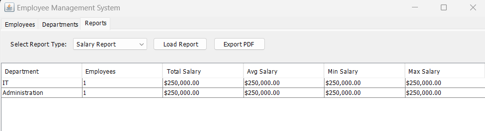
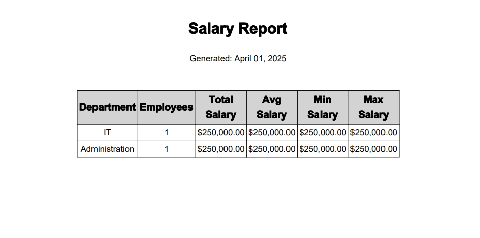

# Employee Management System 🚀

[](https://openjdk.org/)
[](https://www.mysql.com/)
[](LICENSE)

## Overview
A robust Java Swing application for comprehensive employee and department management. Features include:

- 💻 CRUD operations for departments and employees
- 📊 Dynamic report generation (Salary, New Hires, Department Analysis, Monthly)
- 📤 Professional PDF exports with formatted tables
- 🛡️ Database integrity with MySQL constraints

 

---

## Key Features
### 1. Core Functionality
- **Department Management**
  - Add/Edit/Delete departments
  - Track location and budgets
- **Employee Management**
  - Manage employee records with salaries
  - Track department assignments
  - Monitor join dates

### 2. Advanced Reporting
- **Real-time Reports:**
  - Salary Statistics by Department
  - New Hires (Last 30 Days)
  - Department Budget Utilization
  - Monthly Hiring Trends

### 3. PDF Export Engine
- Professional document formatting
- Automatic currency/number formatting
- Dynamic column alignment
- Centered tables with headers/footers

### 4. Database Features
- MySQL 8.0+ backend
- Proper relational structure
- Foreign key constraints
- Indexed queries for performance



---

## Technology Stack
| Component               | Technology/Library           |
|-------------------------|------------------------------|
| **Frontend**            | Java Swing                   |
| **Backend**             | MySQL 8.0                    |
| **PDF Generation**      | iText 7.2.5                  |
| **Dependency Management** | Maven                      |
| **Unit Testing**        | JUnit 5                      |

---

## Installation
### Prerequisites
- Java 21+ JDK
- MySQL 8.0+ Server
- Maven 3.6+

### Setup
1. Clone repository
```bash
git clone https://github.com/paladin-2024/WORKING-WITH-ITEXTSHARP.git
